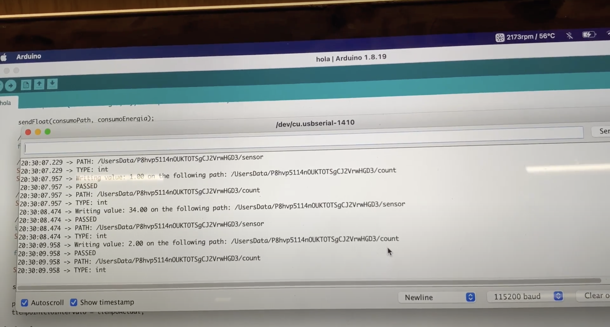
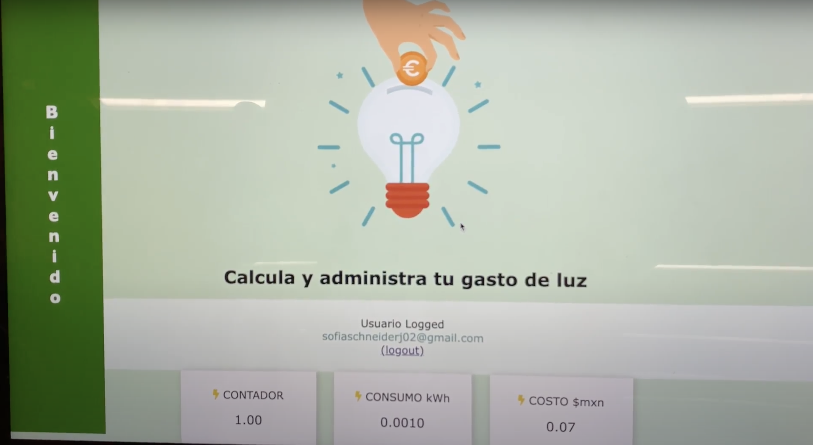
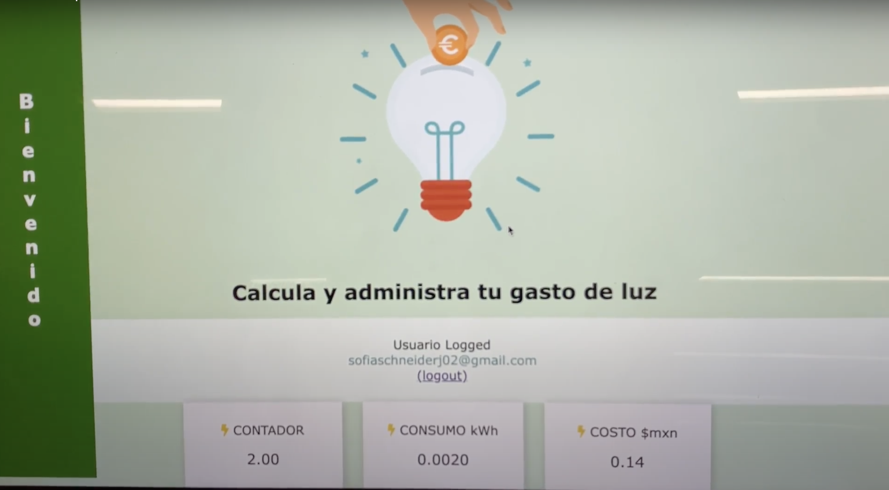
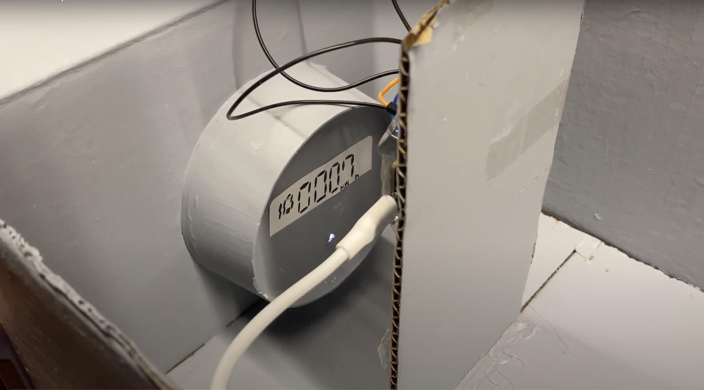
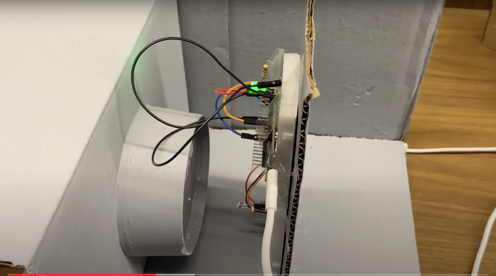

# CasaNet: Smart Home Energy Management for Sustainable Living

CasaNet addresses the critical global issue of greenhouse gas emissions from energy usage, which constitutes about 70% of the global total, with energy generation and heat supply contributing significantly. This IoT-based project is designed to enhance energy efficiency in residential settings without compromising comfort, providing a cost-effective solution aligned with the Sustainable Development Goal (SDG) 11 for Sustainable Cities and Communities.

## Techonological Integration:

* Combines the capabilities of Arduino and NodeMCU with ESP8266 for robust signal processing, offering a powerful foundation for the IoT functionalities of CasaNet.
* Employs a photoresistor sensor for capturing light meter flashes, translating these into accurate real-time measurements of energy usage in kWh and providing insights into associated costs.
*Utilizes Firebase for secure, scalable data storage, ensuring that all energy consumption data is systematically organized, easily accessible, and reliable.
*Develops a user-friendly interface with HTML, CSS, and JavaScript, facilitating intuitive interaction and data visualization. This approach ensures seamless user experiences across both web and mobile platforms, making energy management accessible to all.

## Objective & Hypothesis:

Our goal is to optimize household electrical consumption using IoT, aiming to improve energy efficiency, security, and comfort without impinging on user convenience. We hypothesize that a successfully implemented connected network, tailored to occupants' behavior, will significantly optimize household energy needs.

## Sustainability & Innovation:

CasaNet emphasizes energy efficiency to reduce greenhouse gas emissions, aligning with the goal of creating sustainable cities. The project's innovative edge comes from integrating advanced technologies like IoT, machine learning, and OpenAI, adding sophistication and intelligence to the system. Moreover, CasaNet aims to drive social innovation by educating users on the impact of their daily choices on energy consumption and environmental sustainability.

## Results: 

The CasaNet system was meticulously designed to offer precise real-time measurements of electrical consumption, ensuring the photoresistor sensor's effective connectivity with the microcontroller. We carefully calibrated the system to align measurements with actual consumption rates and scrutinized the accuracy of real-time electrical cost calculations. The flash counter's ability to accurately reflect electrical activity was thoroughly evaluated, alongside its synchronization with other measurements, demonstrating the system's effectiveness in sensor precision, cost calculation algorithms, and real-time activity reflection.

## Web Page

 

## Outcome:

CasaNet successfully demonstrates the potential of connected networks based on inhabitant behavior to optimize household energy needs, enhancing safety, efficiency, and comfort. The system provides real-time accurate measurements of electrical consumption, effectively connects the photoresistor sensor with the microcontroller for flash counting, and accurately calculates real-time energy costs, showcasing the precision of sensors and the synchronization of flash counting with real-time electrical activity.
